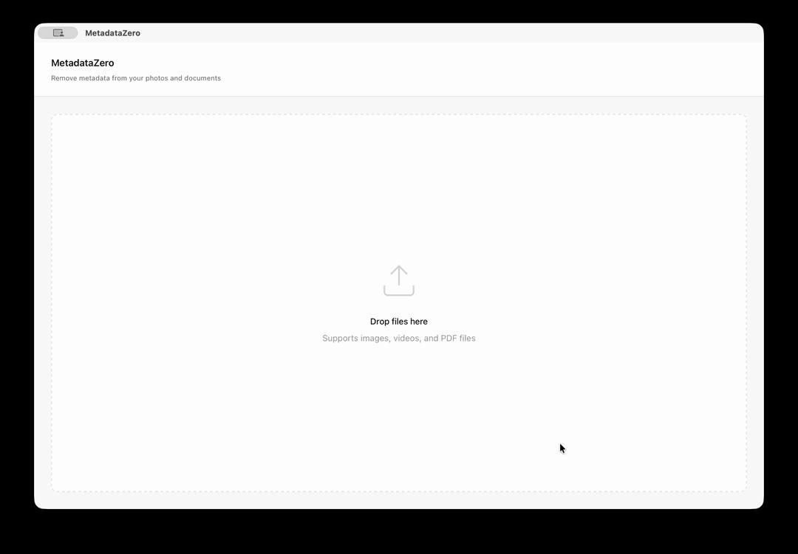

# MetadataZero

> A free, modern, cross-platform desktop application for removing metadata from photos, videos, and PDF files with privacy in mind.

## Table of Contents

- [Overview](#overview)
- [Features](#features)
- [Demo](#demo)
- [Download](#download)
- [Homebrew](#homebrew-macos)
- [File Support](#file-support)
- [MetadataZero vs ExifCleaner](#metadatazero-vs-exifcleaner)
- [Quick Start](#quick-start)
- [Development](#development)
- [How It Works](#how-it-works)
- [Metadata Removal Limitations](#metadata-removal-limitations)
- [Important Notice](#important-notice)
- [License](#license)

## Overview

MetadataZero is a privacy-focused desktop application that helps you protect your personal information by removing embedded metadata from your files. Built with Rust, React, and TypeScript, it combines the power of ExifTool with a modern, intuitive interface.

**Why Remove Metadata?**

Photos, videos, and documents often contain hidden metadata that can reveal:
- GPS coordinates of where files were created
- Device information and camera settings
- Software used for creation/editing
- Timestamps and user information
- Copyright and ownership data

MetadataZero gives you control over this information with a simple drag-and-drop interface.

## Features

### Privacy & Security
- **Comprehensive Metadata Removal** - Uses ExifTool for thorough cleaning of all metadata types
- **100% Offline** - No internet connection required; all processing happens locally
- **Local Processing** - All operations happen on your device; no files are uploaded to external servers
- **Safe by Default** - Creates new files with "_cleaned" suffix, preserving your originals

### User Experience
- **Drag & Drop Interface** - Simple, intuitive file and folder handling
- **Real-Time Preview** - View metadata before cleaning to understand what will be removed
- **Batch Processing** - Clean multiple files simultaneously with parallel processing
- **Fast & Lightweight** - Built with Rust for high-speed processing with minimal resource usage
- **Visual Feedback** - Progress indicators and status updates for all operations
- **Dark Mode** - Comfortable viewing in any lighting condition

## Demo




## Download

MetadataZero is available for macOS, Windows, and Linux.

| Platform | File Type | Important Notes |
|---------|-----------|----------------|
| **macOS** | `.dmg` / `.app` | **Unsigned. Gatekeeper will block it.** To run it: `xattr -dr com.apple.quarantine /Applications/MetadataZero.app` |
| **Windows** | `.exe` | **Unsigned.** Windows SmartScreen will warn. Click “Run anyway.” |
| **Linux** | `.AppImage` / `.deb` / `.rpm` | For AppImage: `chmod +x MetadataZero.AppImage` |

Download here: **https://github.com/metadatazero/metadatazero/releases**

No internet connection is required after installation.
All processing is performed **locally on your device** for maximum privacy.

## Homebrew (macOS)

MetadataZero is also available through a dedicated Homebrew tap:

```bash
brew tap metadatazero/tap
brew install --cask metadatazero
xattr -dr com.apple.quarantine /Applications/MetadataZero.app
```

## File Support

List of file formats for which MetadataZero is capable of removing at least one metadata field:

3G2, 3GP2, 3GP, 3GPP, AAX, AI, AIT, ARQ, ARW, AVIF, CR2, CR3, CRM, CRW, CIFF, CS1, DCP, DNG, DR4, DVB, EPS, EPSF, PS, ERF, EXV, F4A, F4B, F4P, F4V, FFF, FLIF, GIF, GPR, HDP, WDP, JXR, HEIC, HEIF, IIQ, IND, INDD, INDT, INSP, JP2, JPF, JPM, JPX, JPEG, JPG, JPE, LRV, M4A, M4B, M4P, M4V, MEF, MIE, MOS, MOV, QT, MP4, MPO, MQV, NEF, NRW, ORF, PDF, PEF, PNG, JNG, MNG, PPM, PBM, PGM, PSD, PSB, PSDT, QTIF, QTI, QIF, RAF, RAW, RW2, RWL, SR2, SRW, THM, TIFF, TIF, X3F, WEBP.

For the complete list of supported file types with technical details, see [ExifTool Supported File Types](https://exiftool.org/#supported).

## MetadataZero vs ExifCleaner

| Feature / Capability             | MetadataZero                                   | ExifCleaner                         |
| -------------------------------- | ---------------------------------------------- | ----------------------------------- |
| Apple Silicon (M1) Support       | Native                                         | No                                  |
| Startup & Performance            | Fast, lightweight                              | Slower to launch, heavier footprint |
| Memory Usage                     | Low                                            | Higher                              |
| Security Model                   | Rust backend + strict CSP                      | Larger attack surface               |
| Drag & Drop Folders              | Yes, including recursive                       | No                                  |
| Preservation Options             | Color profiles, orientation, modification date | No granular control                 |
| WebP Support                     | Yes                                            | No                                  |
| TIFF Metadata Cleaning           | Cleans common IFD0 tags                        | Limited                             |
| Output Safety                    | Always saves new cleaned file                  | Unsafe overwrite                    |
| Auto Updates                     | Yes (can be disabled)                          | No                                  |

## Quick Start

1. Download the free installer for your platform
2. Launch MetadataZero
3. Drag and drop files or folders into the window
4. (Optional) Click "Settings" to choose what metadata to preserve
5. Review metadata in the preview panel
6. Click "Clean" or "Clean All" to remove metadata

## Development

### Prerequisites

- **Node.js** v24+
- **npm** 11+
- **Rust and Cargo** 1.77.2+
- **Platform-specific requirements:**
  - macOS: Xcode Command Line Tools
  - Linux: Development libraries (webkit2gtk, libssl-dev, etc.)
  - Windows: Visual Studio Build Tools

### Installation

```bash
npm install
```

### Running Development Server

```bash
npm run tauri dev
```

### Tech Stack

- **[Tauri](https://tauri.app/)** - Lightweight desktop framework with Rust backend
- **[React](https://react.dev/)** - Modern UI library
- **[TypeScript](https://www.typescriptlang.org/)** - Type-safe development
- **[Vite](https://vitejs.dev/)** - Fast build tool and dev server
- **[ExifTool](https://exiftool.org/)** - Industry-standard metadata manipulation
- **[Rust](https://www.rust-lang.org/)** - High-performance backend logic

## How It Works

1. **Drag and Drop** - Add files or folders by dragging them into the application window
2. **Metadata Preview** - View existing metadata including GPS, camera info, and timestamps
3. **Configure Options** - Click "Settings" to choose what metadata to preserve
4. **Single Clean** - Click "Clean" to remove metadata from individual files
5. **Batch Clean** - Click "Clean All" to process multiple files in parallel
6. **Safe Output** - New files are created with "_cleaned" suffix, keeping originals intact

**Preservation Options**: By default, all metadata is removed for maximum privacy. You can optionally preserve:
- **Image Orientation** - Keeps orientation metadata so images display correctly
- **Color Profile** - Preserves color space and ICC profile information for accurate colors
- **Modification Date** - Keeps the file's last modified timestamp unchanged

**⚠️ Important**: Always keep backups of important files before cleaning.

## Metadata Removal Limitations

Metadata removal is not always absolute. Some formats store metadata in multiple internal structures, and not all of them can be deleted without re-encoding or rebuilding the file. MetadataZero relies on ExifTool, and while it removes standard and commonly identifiable metadata blocks, some embedded information may still remain depending on the format.

Below is a summary of what to realistically expect:

| File Format | What Gets Removed | What May Remain | Notes |
|------------|------------------|-----------------|-------|
| **JPEG** | Most metadata blocks (APP segments) and trailers | Adobe APP14 segment | Typically results in a near-total clean. |
| **TIFF** | XMP, IPTC, ICC profile, EXIF IFD | Some EXIF stored in IFD0 | Cleaning may require manually targeting specific fields. |
| **PNG** | XMP, EXIF, ICC profile, standard text chunks | Non-standard chunks | PNG can contain custom metadata chunks that are not standardized. |
| **PDF** | XMP and visible metadata fields | **Original metadata often remains internally** | Full metadata removal requires PDF reconstruction, not just tag deletion. |
| **MOV / MP4** | Most top-level metadata atoms | Embedded or proprietary metadata | Some camera manufacturers store extra metadata blocks in non-standard locations. |
| **RAW Formats (CR2, NEF, ARW, etc.)** | Standard metadata blocks | **Proprietary camera-specific data** (often required for proper rendering) | Removing everything can break color interpretation, thumbnails, etc. |

**Important:**  
MetadataZero does **not** remove extended filesystem attributes such as macOS file tags, quarantine flags, Windows ADS streams, or other OS-level metadata. These exist outside the file contents and are controlled by the operating system.

**If your threat model requires guaranteed zero metadata:**  
You will need **format conversion or full re-encoding**, especially for:
- PDF
- Video files
- RAW camera formats


## Important Notice

**This application is provided without any warranty.** We strongly recommend backing up your files before using MetadataZero. Use at your own risk.

## License

This project is licensed under the Apache License 2.0 - see the [LICENSE](LICENSE) file for details.

---

**Made with ❤️ for privacy-conscious users**
